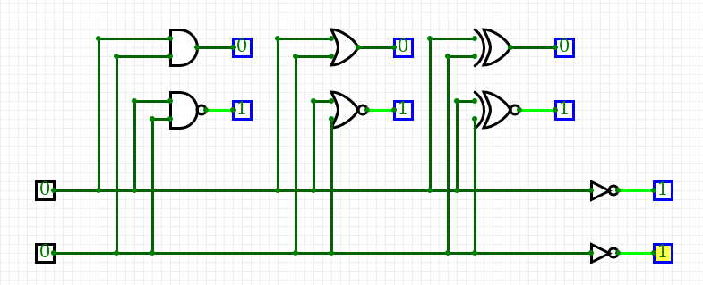
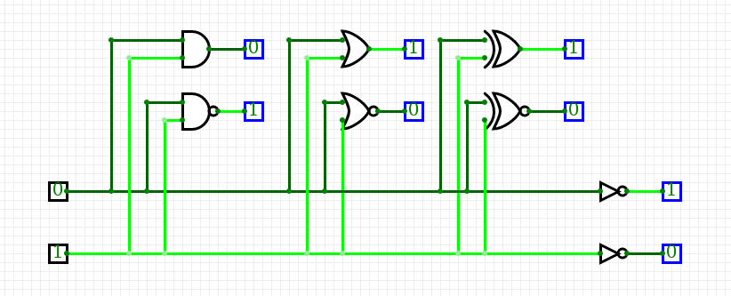
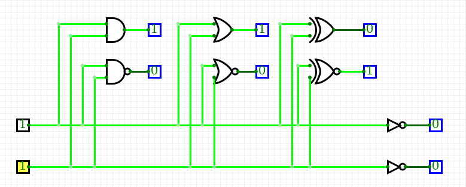

1. Gates truth tables

   | **A** | **NOT** |
   | :-: | :-: |
   | 0 | 1 |
   | 1 | 0 |

   | **A** | **B** | **AND** | **NAND** |
   | :-: | :-: | :-: | :-: |
   | 0 | 0 | 0 | 1 |
   | 0 | 1 | 0 | 1 |
   | 1 | 0 | 0 | 1 |
   | 1 | 1 | 1 | 0 |

   | **A** | **B** | **OR** | **NOR** |
   | :-: | :-: | :-: | :-: |
   | 0 | 0 | 0 | 1 |
   | 0 | 1 | 1 | 0 |
   | 1 | 0 | 1 | 0 |
   | 1 | 1 | 1 | 0 |

   | **A** | **B** | **XOR** | **XNOR** |
   | :-: | :-: | :-: | :-: |
   | 0 | 0 | 0 | 1 |
   | 0 | 1 | 1 | 0 |
   | 1 | 0 | 1 | 0 |
   | 1 | 1 | 0 | 1 |

2. De Morgan's Law

&nbsp;

    
&nbsp;
    

    
&nbsp;

| **A** | **B** |**C** |  |  |  |
| :-: | :-: | :-: | :-: | :-: | :-: |
| 0 | 0 | 0 |  |  |  |
| 0 | 0 | 1 |  |  |  |
| 0 | 1 | 0 |  |  |  |
| 0 | 1 | 1 |  |  |  |
| 1 | 0 | 0 |  |  |  |
| 1 | 0 | 1 |  |  |  | 
| 1 | 1 | 0 |  |  |  |
| 1 | 1 | 1 |  |  |  |
