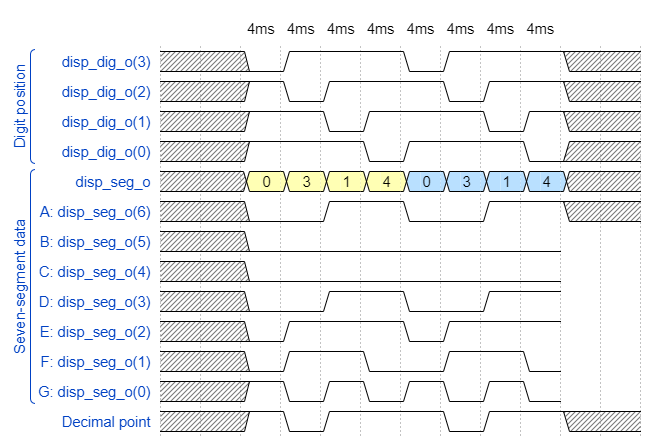

# Lab 6: Driver for seven-segment display

## 1 Preparation tasks (done before the lab at home)

1. See [reference manual](../../Docs/coolrunner-ii_rm.pdf) of the Coolrunner board, find out the connection of 7-segment display, and complete the signal timing to display `03.14` value. Note that the duration of one symbol is 4&nbsp;ms.

    &nbsp;
    
    &nbsp;

