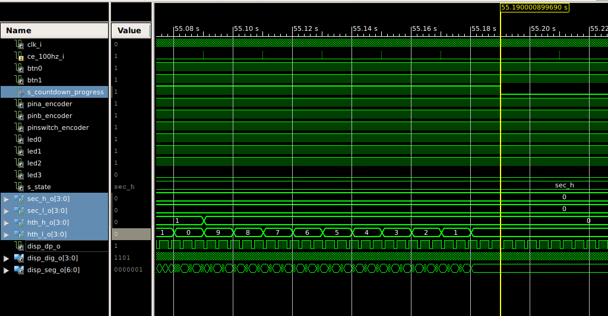

# Project Digital electronics 1

In this project we are implementing a module able to countdown from a set value to zero. The set value will be given by the rotary encoder KY-040 with button and the output will be displayed on the serial 7-segment display with control circuit TM1637.

## Rotary encoder KY-040 with button

The KY-040 rotary encoder is a rotary input device that provides an indication of how much the knob has been rotated and in what direction it is rotating. We will use the knob to set each number of the 4 digits we are working with (seconds and hundredths) to set the start value for the countdown. We will use the button included to switch the selected digit we want to modify. We will use the 4 LEDS below the 7 segments to show to the user which digits is currently selected. 

### KY-040 pinout

The device has 5 pins. + will obviously be connected with 5V and GND with groung. The pushbutton swith will be used as a normal button and will be connected to a pin of the board set on pull-up so the value when pressed will be 0. The 2 others inputs are used to determine that the knob is rotating, in which direction and how much its rotating. 

### KY-040 Management of pins A and B

The pictures below explain how it works, A and B connected to pulled-up pins and compared to the ground. When the knob is rotating it modifies the values of A and B. We just have to the change of value of A to check if the knob is rotating and then we have to check the value of B, if values of A and B are different its rotating clockwise, if they are the same its rotating counter clockwise.

## 7 segments display

We will use the same 7 segments as we used during labs, so we will use the same VHDL module we created for labs to manage the display of numers. We can see below the 7 segments the 4 LEDS we will use for the user to know which digit is selected to modify. The LED3 will correspond to the tens of the seconds, the LEDS 2 to the units of the seconds...

The 7 segments has 4 digits : 2 for seconds and 2 for hundredths so the countdown will be updated every 10 ms (hundredths) we have to choose a period to be sure the hundredths will be updated by the driver between 2 incrementation of the counter, we can choose 1 ms, indeed with 1 ms it takes 4 ms for the driver to update the 4 digits. 

## Clock Enable Module

The clock enable module we have implemented during labs will be used to manage the countdown that have to be updated every 10 ms so the clock enable will be set on 100 Hz and to manage the 7 segments as said before.

## Fonctionalities 

-	The value of the counter will be displayed on the 7 segments device of the CoolRunner II board. 
-	The rotary encoder will be used to set the value of one digit, the user will be able to increase the value by turning the knob clockwise and deacrease the value by turning the knob counter clockwise.
-	By pressing the button of the encoder the used will be able to switch between the 4 differents values of the counter, the current selected digit will be shown by the 4 LEDs below the 7 segments device.
-	By pressing the button 0 of the board the user will be able the reset the counter, the 7 segments will be reset to 00.00 and the selected digit will be set on the hundredths.
-	By pressing the button 1 of the board the user will be able to start the countdown. The value can't be set anymore when the countdown is in progress.

## Schematics

Screenshots below are showing RTL implementaton of our modules, we can see the schematic of top level and the schematic of modules used inside the top level.

## Simulations

To verify the proper functioning we did some simulations, we gathered simulations of all fonctionalites in one testbench : "tb_top".

### Setting of the value

On the screen above we can see that the waveforms of pinA and pinB are simulating the rotation of the encoder. We can see that at the start the rotation clockwise (pinA wave ahead of pinB wave) increases the hundredths then the rotation counter clockwise (pinB wave ahead of pinA wave) deacreases the hundredths. We can conclude that our module manages the rotation in both directions

### Selecting the digit

On this screen we are simulating the change of selected digit. The input "pinswitch_encoder" is the rotary encoder buttun and pressing it changes the selected digit. We are seeing that pressing this button changes the digit selected with the "s_state" signal and the shining LED that represent the selected digit (LEDs are active low). We are also seeing that by changing the selected digit we can set values on each digit. 

### Starting the countdown

On this screen we can see that pressing the button 1, the button to start the countdown, puts the signal "s_countdown_progress" to '1' even when the button is unpressed and starts the countdown. We can the hundredths and tenths deacrese.

### Trying to change the value during the countdown

This simulation screen shows that it's not possible to modify the values of the digits by turning the knob of the encoder when the countdown is in progress, indeed the pinA and pinB signals are indicating a knob rotating clockwise but the value of the tens (the digit selected as we can see on the signal "s_state") is not increasing by the rotation but just deacreases because of the normal countdown. 

### 7 segments display
 

This screen shows that the 7segments is displaying correctly the values of the digits. The screen is showing the moment where the counter is at the value 49:22. At 5.960 s the driver is sending the dispay of the hundredths ("disp_dig_o" at "1110", '0' indicated the digit selected) and we can see that the value of "disp_seg_o" is "0010010" that corresponds to 2 as we can see on the schematic of a 7 segments below. The same for the tenths at 5.961 s because value is also 2. At 5.962 s the value of "disp_seg_o" is "0000100" that corresponds to 9 and "disp_dp_o" is at '0' that indicated the dot is displayed to separate the seconds from the hundredths. At 5.963 s the value of "disp_seg_o" is "1001100" that corresponds to 4. We can conclude that the 7 segments are correctly displaying the values of the counter. 
 

### Synchronous reset
 

We can see here that the button 0 that corresponds to the reset button is pressed. The signal "s_countdown_progress" become '0' and the values of the four digits are set to '0', the countdown is obviously stopped and the selected digit is now the hundredths (LED0 on). The clock enable of 100 Hz and the 7 segments are also stopped durring the reset. 

### Timing verificaion
  

These two screens above show that the duration of the countdown from 54:82 to 00:00 which begins at 0.36 s on the simulation fninishes at 55.18 s (55.19 s is the timing where the signal "s_countdown_progress" becomes '0', one clock enable rising edge after the value 00:00) what makes a duration of 54.82 s, exaclty the value set before. That is showing our module is working good in term of timing. 

## Sources 
https://www.youtube.com/watch?v=v4BbSzJ-hz4
